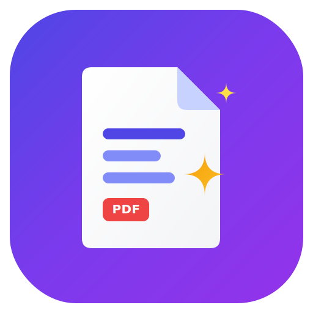

# Document Q&A System (PDF Oracle)

A high-performance, production-ready **Document Q&A System** powered by Retrieval-Augmented Generation (RAG). Upload multi-page PDFs, ask natural-language questions, and get precise answers grounded strictly in your uploaded documents — complete with page numbers, relevance scores, and interactive source citations.



---

## 🌟 Key Features

- **Document Q&A Engine**: Natural-language question answering grounded 100% in your uploaded documents.
- **Client-Side Processing**: Multi-PDF drag-and-drop text extraction performed directly in the browser using `pdfjs-dist`.
- **Browser-Native Embedding Pipeline**: Computes 384-dimensional vector embeddings in the browser using `@xenova/transformers` (`Xenova/all-MiniLM-L6-v2`).
- **IndexedDB Vector Store**: Vector indices are cached locally in IndexedDB so you don't need to re-index documents on page refreshes.
- **Cosine Similarity Retrieval**: Top-K vector retrieval with similarity score thresholds to eliminate irrelevant passages.
- **Strict Grounding**: Uses OpenRouter LLM APIs with strict system prompts to prevent hallucinations and force fallback when content isn't present in the documents.
- **Interactive Citations**: Per-answer collapsible source cards showing document name, page number, relevance score percentage, and text snippets.
- **Modern UI & Theme**: Built with Vite, React 19, Tailwind CSS v4, and Lucide Icons, offering responsive dark and light modes.

---

## 🛠️ Instructions to Run Locally

### Prerequisites

Ensure you have the following installed on your machine:
- **Node.js**: v18.0.0 or higher
- **npm** (v9+) or **bun** (v1.0+)
- **Git**

---

### Step 1: Clone the Repository

```bash
git clone https://github.com/Satyam12705/pdf-oracle.git
cd pdf-oracle
```

---

### Step 2: Install Dependencies

Using `npm`:
```bash
npm install
```

Or using `bun`:
```bash
bun install
```

---

### Step 3: Configure Environment Variables

1. Copy `.env.example` to create your local `.env` file:
   ```bash
   cp .env.example .env
   ```

2. Open `.env` and add your **OpenRouter API Key**:
   ```env
   OPENROUTER_API_KEY=sk-or-v1-your-actual-openrouter-key-here
   ```

> 💡 **Note**: You can get an API key from [OpenRouter.ai](https://openrouter.ai/keys).

---

### Step 4: Start the Development Server

Using `npm`:
```bash
npm run dev
```

Or using `bun`:
```bash
bun dev
```

Open your browser and navigate to:
```
http://localhost:3000
```
(or the port shown in your terminal).

---

### Step 5: Build for Production

To test the production build locally:
```bash
npm run build
npm run preview
```

---

## 🏗️ System Architecture & Workflow

```
 ┌────────────────┐     ┌──────────────────┐     ┌──────────────────────┐
 │   Upload PDF   │ ──> │ Extract Text     │ ──> │ Sentence-Aware       │
 │  (pdfjs-dist)  │     │ (Per Page)       │     │ Chunking with Overlap│
 └────────────────┘     └──────────────────┘     └──────────────────────┘
                                                            │
                                                            ▼
 ┌────────────────┐     ┌──────────────────┐     ┌──────────────────────┐
 │  OpenRouter    │ <── │ Top-K Cosine     │ <── │ Browser Embeddings   │
 │  LLM Answer    │     │ Similarity Search│     │ (Xenova Transformers)│
 └────────────────┘     └──────────────────┘     └──────────────────────┘
```

1. **Extraction**: `src/lib/rag/pdf.ts` reads the raw PDF binary array and extracts page-by-page text.
2. **Chunking**: `src/lib/rag/chunking.ts` splits text into sentence-aware overlapping chunks (e.g. 500 characters with 100 character overlap).
3. **Embeddings**: `src/lib/rag/embeddings.ts` passes chunks through `Xenova/all-MiniLM-L6-v2` in a web worker thread to generate 384-d vectors.
4. **Vector Storage**: `src/lib/rag/vector-store.ts` saves vector records into browser IndexedDB (`idb-keyval`).
5. **Retrieval**: Query text is vectorized, matched via cosine similarity, and top relevant passages above the score threshold are selected.
6. **Generation**: `src/lib/ask.functions.ts` sends retrieved context and question to OpenRouter LLM for strict grounded generation.

---

## 🚀 Deployment Instructions

### 1. Deploying to Vercel (Recommended)

1. Fork or push this repository to your GitHub account (`Satyam12705/pdf-oracle`).
2. Go to [Vercel Dashboard](https://vercel.com/new) and import the repository.
3. Add the environment variable:
   - Name: `OPENROUTER_API_KEY`
   - Value: `sk-or-v1-...`
4. Click **Deploy**. Vercel will automatically detect `vercel.json` and build the application.

---

### 2. Deploying to Netlify / Render / Cloudflare Pages

- **Build Command**: `npm run build`
- **Output Directory**: `.output/public`
- **Environment Variables**: Set `OPENROUTER_API_KEY` in project settings.

---

## 📁 Repository Structure

```
pdf-oracle/
├── public/
│   ├── favicon.svg           # High-res vector favicon
│   └── favicon.ico           # Legacy favicon fallback
├── src/
│   ├── components/
│   │   ├── qa/               # Upload zone, chat panel, sources, dashboard stats
│   │   └── ui/               # Reusable UI primitives (buttons, dialogs, cards)
│   ├── config/app-config.ts  # RAG configuration parameters & models
│   ├── hooks/                # Custom React hooks (use-documents, use-theme)
│   ├── lib/
│   │   ├── rag/              # PDF extraction, chunker, embeddings, vector store
│   │   └── ask.functions.ts  # TanStack server function calling OpenRouter API
│   ├── routes/               # TanStack Router pages and root layout
│   └── server.ts             # SSR server entry point
├── vercel.json               # Vercel deployment configuration
├── .env.example              # Environment variables template
├── package.json              # Dependencies and scripts
└── vite.config.ts            # Vite & Nitro build setup
```

---

## ⚙️ Configuration Tuning

All RAG hyperparameters can be tuned in `src/config/app-config.ts`:

```typescript
export const appConfig = {
  openrouter: {
    model: "google/gemini-2.5-flash", // Any OpenRouter chat model ID
    temperature: 0.1,
    maxTokens: 1024,
  },
  embedding: {
    model: "Xenova/all-MiniLM-L6-v2",
  },
  chunking: {
    chunkSize: 500,
    overlap: 100,
  },
  retrieval: {
    topK: 6,
    minScore: 0.3,
  },
};
```

---

## 📄 License

MIT License. Free to use, modify, and distribute for personal and commercial applications.